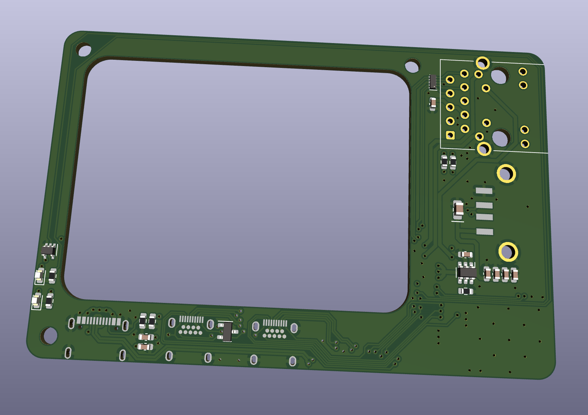
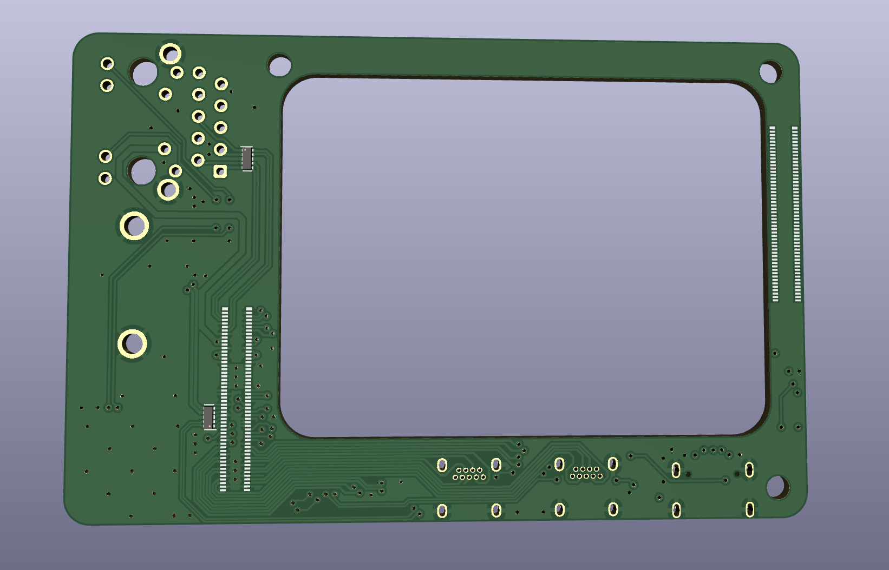

# cm4crypto

cm4crypto is an adapter board that allows you to use an M-Key M.2 compatible module with the Raspberry Pi Compute Module 4 (cm4).

adding fast terabyte SSD options within a sleek RPi 4 format makes the cm4crypto perfect for uses like:
* participating in blockchain networks
* acting as a home media server
* hosting a local database

## status

this project is no longer actively developed.
the source material will continue to be available for reference.

additional resources:

* [onshape model](https://cad.onshape.com/documents/3095ac02ee5d7dd8a1b9e12a/w/86bdcc88d4120b9515956abd/e/6d8a025f4a8b2a44825a6443?renderMode=0&uiState=6629d60ecf655f459d6d604c)
* [time lapse of routing the board](https://www.youtube.com/watch?v=GDdp88jEIow)

## features

* Adds M.2 M-Key PCIe x1 interface for use with NVMe SSDs or other compatible modules
* Designed for use in the [Flirc RPi 4 case](https://flirc.tv/more/raspberry-pi-4-case)
* Power Over Ethernet (PoE) support
* Camera Interface

# M.2 compatibility

M.2 specifies a connector layout, standard interfaces, and a few form factors. with such a wide variety of options available no single product can hope to support them all. here are the things you should check to see if your desired module is compatible:

property | value | notes
--- | ------- | ------
key | **M** | the M.2 connector on the cm4crypto uses an **M key**
interface | **PCIe x1** | though the M key standard supports PCIe x4 the cm4 only has x1 PCIe lane available. thanks to PCIe compatibility this should only reduce performance, not prevent functionality
dimensions | up to **22 x 80** mm | to fit in the case 

## RPi 4 compatibility

the cm4rypto inherently gains some compatibility with RPi 4 accessories since it was designed to work with the sleek Flirc case however design tradeoffs had to be made as well. 

### compatible

* 1x Gigabit ethernet
* 2x micro HDMI ports
* 1x USB-C port for power or USB OTG
* 1x USB-A port (USB 2.0)

### discrepancies

* there is **no 3.5mm audio jack**
* **GPIO is very limited** - only GPIO 2, 3, and 14 are available along with the first set of power pins (for PoE compatibility)
* the **camera interface is relocated** so that it comes out near the sd card
* the **sd card receptacle is slightly offset** to allow for the M.2 connector

## compatible / recommended products

### cases
* [Flirc Raspberry Pi 4 Case](https://flirc.tv/more/raspberry-pi-4-case)

### PoE hats
* [CMC Tech 3.5A](https://cctvfactory.com/copy-of-cmc-tech-5-2v-3-5a-17-5watt-power-over-ethernet-poe-hat-for-raspberry-pi-4-model-b-and-pi-3-model-b-ieee-802-3af-or-802-3at-poe-network-standard-compliant-made-in-rpc/) (available on Amazon)
* 

# show and tell

